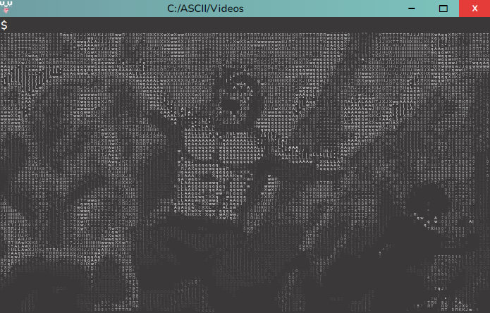

# ASCII Player 

# Check it out :t-rex:

[:heart: ASCII Player :heart:](https://jhonatanvicg.github.io/AsciiPlayer/)

## About this project :bug:

Who does not enjoy seeing figures formed with ascii code in your terminal?:heart:

Well i dont know how to made it in c or c++ or c#, but i have Javascript:heart_on_fire: ,a lot of free time and imagination to try to simulate a terminal.

I think i did a decent work. So enjoy it :ramen:

